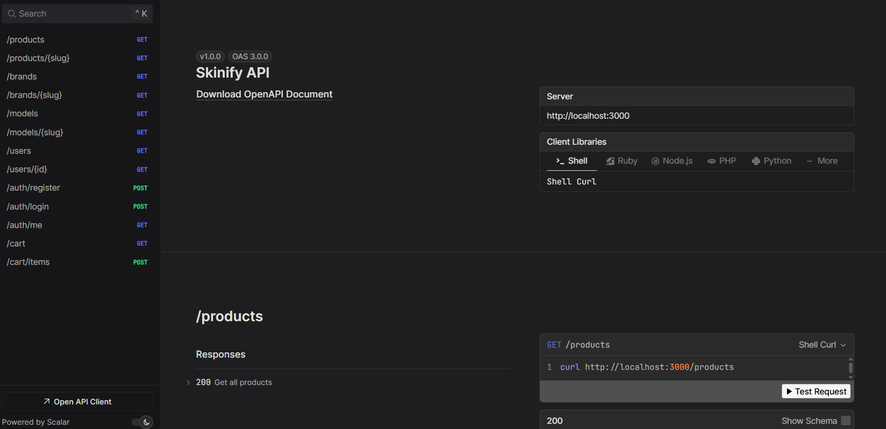

# Skinify Backend

A backend API for Skinify, an e-commerce website for mobile skins. Built with Bun, Hono, Prisma, and PostgreSQL.



## ERD Diagram


## REST API Specification

- Production: `https://skinify-api.onrender.com`
- Local: `http://localhost:3000`

Products:

| Endpoint          | HTTP  | Description         |
| ----------------- | ----- | ------------------- |
| `/brands`         | `GET` | Get all brands      |
| `/brands/:slug`   | `GET` | Get brand by slug   |
| `/models`         | `GET` | Get all models      |
| `/models/:slug`   | `GET` | Get model by slug   |
| `/products`       | `GET` | Get all products    |
| `/products/:slug` | `GET` | Get product by slug |

Auth:

| Endpoint         | HTTP   | Permission    |
| ---------------- | ------ | ------------- |
| `/users`         | `GET`  | Public        |
| `/users/:id`     | `GET`  | Public        |
| `/auth/register` | `POST` | Public        |
| `/auth/login`    | `POST` | Public        |
| `/auth/me`       | `GET`  | Authenticated |
| `/cart`          | `GET`  | Authenticated |
| `/cart/items`    | `POST` | Authenticated |

## Getting Started

Copy and edit `.env` file:

```sh
cp .env.example .env
```

Setup database:

```sh
# Run database only
bun db:up
```

Install dependencies:

```sh
bun install
```

Migrate database and generate Prisma Client:

```sh
bun db:migrate
# prisma migrate dev && prisma generate
```

Seed initial products:

```sh
bun db:seed
# prisma db seed
```

Run development server:

```sh
bun dev
# bun run --hot src/index.ts
```

Open <http://localhost:3000>.

## Production

Make sure the `DATABASE_URL` is configured in `.env` file for usage with Docker Compose.

Build the Docker image:

```sh
bun docker:build
# docker compose up -d --build
```

If only run the Docker container:

```sh
bun docker:up
# docker compose up -d
```

Open <http://localhost:3000>.
